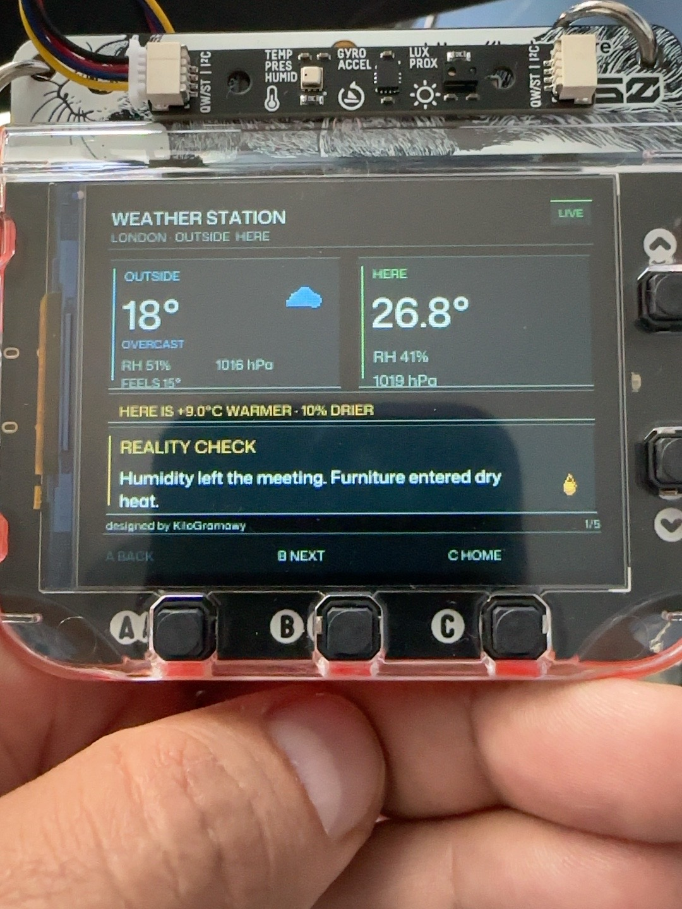
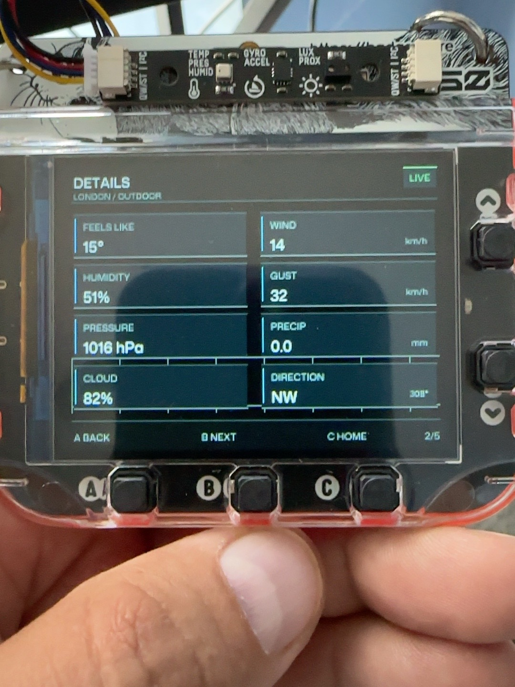
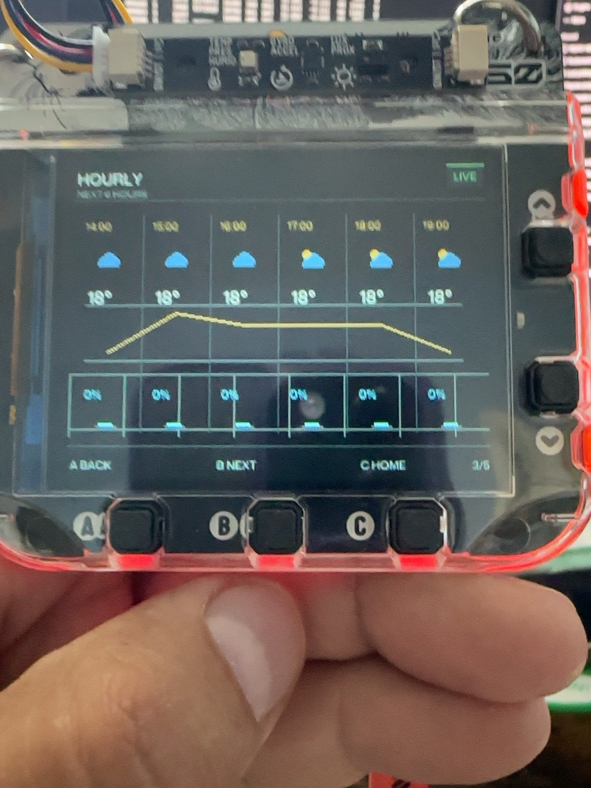
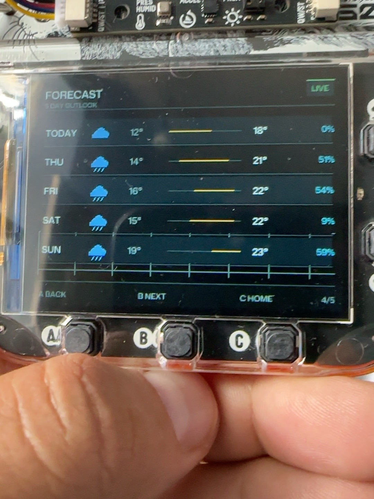
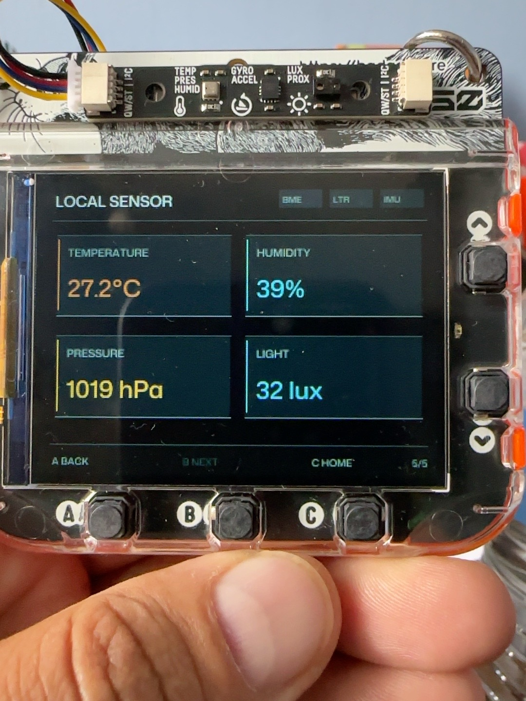

# Tufty Weather Station 🌦️

Created by KiloGramowy

https://github.com/KiloGramowy

https://kilogramowy.pl



Tufty Weather Station is a physically tested BadgeWare dashboard for Pimoroni Tufty 2350. It combines live outside weather from Open-Meteo, local environmental measurements from Pimoroni sensor hardware, forecast views, outside-vs-here comparison, offline/cache handling, and a contextual Reality Check commentary system designed for a compact 320x240 display.

## ✨ Features

- Live current outside weather for the configured location.
- Local temperature, humidity, pressure, and ambient light readings.
- Outside-vs-here comparison for temperature and humidity differences.
- Detailed outside conditions including feels-like temperature, pressure, wind, gusts, precipitation, cloud cover, and wind direction.
- Six-hour forecast view with weather icons, temperature trend, and precipitation probability.
- Five-day forecast view with daily icon, low/high temperature range, and precipitation probability.
- Reality Check contextual commentary with stable IDs, category-aware selection, anti-repeat history, and display-fit validation.
- Cached/offline behaviour for current, hourly, and daily weather data.
- Tested on real Pimoroni Tufty 2350 hardware.

## 🌦️ Main Overview

The hero image above shows the main overview running on physical Tufty 2350 hardware. The main screen compares outdoor conditions with the local room reading. The OUTSIDE panel shows temperature, condition, relative humidity, pressure, feels-like temperature, and a small weather icon. The HERE panel shows locally measured temperature, humidity, and pressure.

The comparison strip summarises whether the local environment is warmer or cooler and wetter or drier than outside. The status indicator reports LIVE, CACHED, or OFFLINE data where available. Reality Check adds a short contextual comment selected from the current outside and local conditions.

## 🌬️ Detailed Outside Conditions



The details page expands the current outdoor weather into individual readings: feels-like temperature, humidity, pressure, wind speed, gust speed, precipitation amount, cloud cover, and wind direction with degrees where available.

## ⏱️ Hourly Forecast



The hourly page displays the next six forecast columns from the fetched hourly data. Each column includes a time label, weather icon, temperature, temperature trend graph position, precipitation percentage, and a small precipitation bar.

## 📅 Multi-Day Forecast



The forecast page displays a five-day outlook. Each daily row shows the day label, condition icon, low temperature, high temperature, a compact temperature range marker, and maximum precipitation probability.

## 🌡️ Local Sensors



The local sensor page shows readings from the attached Pimoroni Multi-Sensor Stick. FINAL V2 displays BME280 temperature, humidity, and pressure, plus LTR-559 ambient light. IMU status is tracked for hardware availability, but the visible local dashboard focuses on environmental readings.

## 🧠 Reality Check

Reality Check is a deterministic contextual commentary system, not an AI service. It derives a semantic category from outdoor weather, local measurements, deltas, light, humidity, pressure, and data availability, then selects a stable-ID comment that fits the approved two-line UI.

The FINAL V2 Reality Check corpus provides 2800 deterministic comment combinations with 2800 stable IDs across 50 categories. The test and audit suite verifies zero exact duplicates, zero normalized duplicates, category-aware selection, anti-repeat behaviour, persistent recent-history handling, banned-content checks, and complete fit at the current Reality Check font size.

## 🎛️ Controls

- `A`: go back one page when a previous page exists.
- `B`: go forward one page when a next page exists.
- `C`: return to the main overview page.

Input is debounced in software. The five pages are NOW, DETAILS, HOURLY, FORECAST, and LOCAL.

## 📡 Weather Data

Weather data comes from Open-Meteo using the configured latitude, longitude, and timezone in `weather_config.py`. The current FINAL V2 configuration targets London (`51.5074`, `-0.1278`, `Europe/London`).

The app requests current conditions, hourly forecast fields, and daily forecast fields from `api.open-meteo.com`. Successful weather refreshes are spaced by `CURRENT_WEATHER_REFRESH_MS`, currently 15 minutes. Failed attempts retry using `CURRENT_WEATHER_RETRY_MS`, currently 60 seconds. Wi-Fi connection handling is isolated in `safe_wifi.py`.

## 💾 Cache & Offline Behaviour

The app stores normalized weather data in `/weather_station_cache.json` using a temporary file for safer writes. Cached data includes current conditions and, when available, hourly and daily forecast data. Cached payloads are restored as CACHED data after restart or when live fetching is unavailable.

Cache writes are rate-limited by `WEATHER_CACHE_WRITE_MIN_MS`, currently 30 minutes, with immediate cache population when no cache exists or when a restored cache is upgraded with a full forecast.

## 🌡️ Sensor Hardware

FINAL V2 is designed for Pimoroni Tufty 2350 with the Pimoroni Multi-Sensor Stick on the Qw/ST I2C port.

Supported sensor paths in the runtime:

- BME280 at `0x76`: local temperature, humidity, and pressure.
- LTR-559ALS-01 at `0x23`: ambient light and proximity reading support.
- LSM6DS3TR-C at `0x6A`: optional motion/orientation availability status.

The runtime initializes sensor drivers once, keeps the app running when optional hardware is unavailable, normalizes Pascal-scale BME pressure to hPa, and keeps the external LTR559 lux reading separate from display auto-brightness.

## 📦 Installation

Copy the complete `weather_station` folder to:

```text
TUFTY:/apps/weather_station/
```

The app is intended to run as a BadgeWare app from that folder. Install the required Pimoroni MicroPython firmware and hardware support modules for Tufty 2350 and the attached sensor hardware.

For Wi-Fi, create or update `/secrets.py` on the Tufty with your private network details. Do not put real Wi-Fi credentials inside the app folder or commit them to source control.

Example shape only:

```python
WIFI_NETWORKS = (
    ("YOUR_HOME_SSID", "YOUR_HOME_PASSWORD"),
    ("YOUR_HOTSPOT_SSID", "YOUR_HOTSPOT_PASSWORD"),
)
```

The legacy single-network `WIFI_SSID` / `WIFI_PASSWORD` format is also supported by the runtime.

## 🔐 Security

Do not commit or publish:

- `secrets.py`
- API keys
- Wi-Fi credentials
- private local configuration
- generated private test builds
- device-specific local files

This project does not require an Open-Meteo API key.

## 🧪 Testing

FINAL V2 validation evidence:

- Reality Check corpus: 2800 comments.
- Stable Reality Check IDs: 2800.
- Exact duplicate Reality Check comments: 0.
- Normalized duplicate Reality Check comments: 0.
- Reality Check comments fit the approved two-line UI at font size 12.
- Full local test suite: 184 tests OK.
- `compileall` passed for runtime and tests.
- Physically tested on real Pimoroni Tufty 2350 hardware.

## License

MIT — see the repository root `LICENSE`.

This contribution is intended for pimoroni/badgeware-contrib, whose root repository is MIT licensed.
